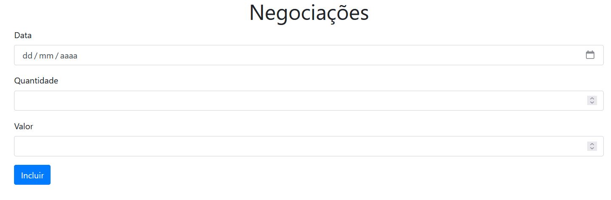

## 📈 Negociações

O **Negociações** é uma aplicação simples de registro de operações financeiras, onde é possível inserir data, quantidade e valor de cada negociação.

 

## 🚀 Sobre o Projeto

Este projeto foi desenvolvido durante o curso da Alura:

* "TypeScript Parte 1: Evoluindo seu JavaScript"

Com o **Negociações**, aplicamos **TypeScript** para evoluir um script JavaScript tradicional, trazendo **tipagem estática, compilação e modularização**, além de modelar classes de negócio de forma mais robusta.

## 📚 Objetivos do Curso

* Aprender a configurar do zero seu ambiente;
* Conhecer gradativamente os recursos do compilador do **TypeScript**;
* Compreender as vantagens da **tipagem estática**;
* Modelar suas classes utilizando o que há de melhor na linguagem;
* Aprender a utilizar tipos, modificadores e outros recursos.

## 🛠️ Tecnologias Utilizadas

## 🖼️ Visualização do Projeto

Uma prévia das principais funcionalidades do **Negociações**:

**📝 Formulário de Inserção**

Campos para data, quantidade e valor, com botão “Incluir” para adicionar nova negociação.

